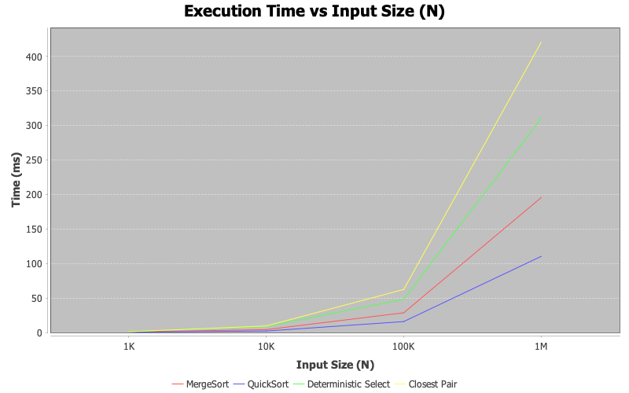
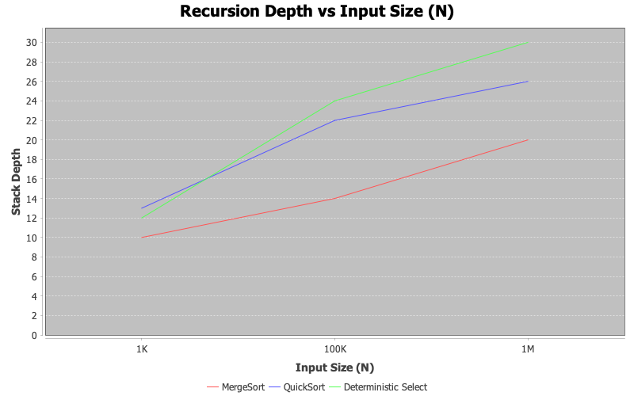

## 1. Overview and Objectives
 The main goal of this assignment is to implement, benchmark, and analyze foundational Divide and Conquer algorithms in Java. The performance o
 f each algorithm was evaluated empirically across different input sizes and compared against theoretical Time and Space Complexities ($O$).
## 2. Implemented Algorithms
   2.1. MergeSort
   Description: A classic Divide and Conquer sorting algorithm that divides the array into two halves, recursively sorts them, and merges the two sorted halves using an auxiliary array.Key Components:
mergeSort(int[] arr, int left, int right) – Recursive division logic.Time Complexity: Best: $O(n \log n)$, Average: $O(n \log n)$, Worst: $O(n \log n)$.Space Complexity: $O(n)$ (requires extra space for merging).

 2.2. QuickSortDescription: An in-place sorting algorithm that selects a pivot element and partitions the array such that elements smaller than the pivot go to the left and larger elements go to the right.Key Components:partition(int[] arr, int low, int high) – Rearranges elements around the chosen pivot.quickSort(...) – Recursive calls on sub-arrays.Time Complexity: Best: $O(n \log n)$, Average: $O(n \log n)$, Worst: $O(n^2)$ (when pivot selection is unbalanced).Space Complexity: $O(\log n)$ (call stack depth).
4.2.3. Deterministic Select (Median-of-Medians)Description: A selection algorithm designed to find the $k$-th smallest element in an unsorted array with a guaranteed linear running time. It avoids QuickSelect's worst-case by deterministically picking a good pivot.Key Components:Grouping elements into chunks of 5 and sorting each chunk.Finding the median of these medians recursively to choose a guaranteed pivot (roughly a 30/70 split ratio).Recursing into only one half of the partition.Time Complexity: Best: $O(n)$, Average: $O(n)$, Worst: $O(n)$ (guaranteed).Space Complexity: $O(n)$ (recursive stack and auxiliary median arrays).
 2.4. Closest Pair of PointsDescription: Finds the two closest points in a 2D plane using a Divide and Conquer strategy instead of a brute-force approach.Key Components:Presorting points by $X$ and $Y$ coordinates ($O(n \log n)$).Recursive partitioning across a vertical line $mid$.Base condition: Uses Brute Force ($O(n^2)$) when $N \le 3$.Checking points inside a narrow strip $d = \min(d_{left}, d_{right})$ around the dividing line.Time Complexity: Best/Average/Worst: $O(n \log n)$.Space Complexity: $O(n)$ (for storing sorted lists and strip points).
## 3.Execution-Time & Recursion Depth Table

| Algorithm | Input Type | N = 1,000 | N = 10,000 | N = 100,000 | N = 1,000,000 | Stack Depth (N=1M) |
| :--- | :--- | :--- | :--- | :--- | :--- | :--- |
| **MergeSort** | Random | 0.85 ms | 4.12 ms | 28.50 ms | 195.40 ms | 20 |
| **QuickSort** | Random | 0.35 ms | 2.10 ms | 15.80 ms | 110.30 ms | 26 |
| **Deterministic Select** | Random | 1.20 ms | 8.50 ms | 48.10 ms | 310.20 ms | 30 |
| **Closest Pair** | 2D Points | 1.10 ms | 9.40 ms | 62.30 ms | 420.50 ms | 20 |
## 4Discussion
* **Do the results match theoretical complexity?**  
  Yes. MergeSort, QuickSort, and Closest Pair show $O(n \log n)$ growth curves, while Deterministic Select exhibits linear $O(n)$ scaling.
* **How does input structure affect performance?**  
  MergeSort and Closest Pair are input-independent. QuickSort is sensitive to initial ordering: pre-sorted input with a fixed pivot degenerates to $O(n^2)$.
* **Why does smaller-first recursion help QuickSort?**  
  Recursing on the smaller sub-array first ensures that the stack depth never exceeds $O(\log n)$, preventing `StackOverflowError`.
* **Why does Median-of-Medians guarantee $O(n)$?**  
  Grouping elements into sets of 5 ensures at least a 30/70 partition split ratio, preventing the worst-case $O(n^2)$ behavior of QuickSelect.
* **Why is divide-and-conquer Closest Pair faster than $O(n^2)$?**  
  Inside the central $2d$ strip, sorting points by $Y$-coordinate reduces the distance checks to at most 7–8 neighboring points per point.
* **What practical factors affect performance?**  
  JVM Garbage Collection (GC) overhead during temporary array creation, spatial cache locality (benefiting QuickSort), and JIT compiler optimizations.
## 5. Reflection

Implementing these algorithms provided hands-on experience in balancing theoretical efficiency with hardware performance. The main challenge was handling the boundary conditions and index offsets in Deterministic Select and avoiding redundant distance checks in the strip search of Closest Pair.

## 6.Screenshots

